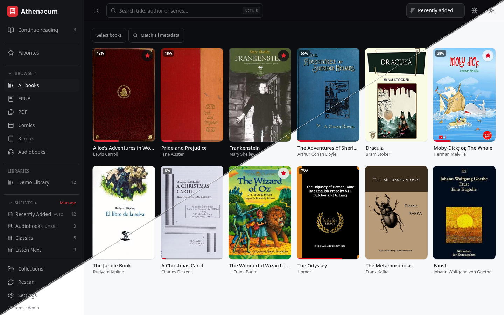

# Athenaeum

> [!WARNING]
> This project is still alpha level software and being actively developed.

Self-hosted library for EPUB, PDF, comics, audiobooks and much more. Single static portable binary.

<p align="center">
  
</p>

## Install

### Installer

```sh
curl -fsSL https://raw.githubusercontent.com/Quad4-Software/Athenaeum/master/install.sh | bash
```

Or download and run it interactively:

```sh
curl -fsSL -o install.sh https://raw.githubusercontent.com/Quad4-Software/Athenaeum/master/install.sh
chmod +x install.sh
./install.sh
```

### Docker (GHCR)

```sh
docker run -d --name athenaeum \
  -p 8080:8080 \
  -v athenaeum-data:/data \
  -v /path/to/books:/library \
  ghcr.io/quad4-software/athenaeum:latest
```

Pin a release with `ghcr.io/quad4-software/athenaeum:v0.1.0` (or another tag).
`latest` tracks `master`. Version tags publish on `v*` releases.

### Docker Compose

```sh
git clone https://github.com/Quad4-Software/Athenaeum.git
cd Athenaeum
cp .env.example .env
# set ATHENAEUM_LIBRARY_HOST_PATH to your media folder
docker compose up -d
```

`docker compose up -d` pulls `ghcr.io/quad4-software/athenaeum:latest`.
Use `docker compose up -d --build` to build locally instead.

Open http://localhost:8080. Create an admin in the setup wizard, or pass
`--admin-user` / `--admin-pass` when no users exist yet.

## Build from source

Requires Go 1.26+, Node 22+, and pnpm 11+. [Task](https://taskfile.dev) is
optional. Make works for build and install.

```sh
git clone https://github.com/Quad4-Software/Athenaeum.git
cd Athenaeum
```

### Task

```sh
task setup
task build
./bin/athenaeum --addr :8080 --library /path/to/books --data ./data
```

### Make

```sh
cd web && pnpm install && cd ..
make build
./bin/athenaeum --addr :8080 --library /path/to/books --data ./data
```

`make help` lists targets (`build`, `install`, `clean`, and so on).

### Manual

```sh
go mod download
cd web && pnpm install && pnpm build && cd ..
mkdir -p bin
go build -trimpath -o bin/athenaeum ./cmd/athenaeum
./bin/athenaeum --addr :8080 --library /path/to/books --data ./data
```

Verify a build with `./bin/athenaeum --self-check` (dirs, database, HTTP).
Release tags publish binaries for Linux (amd64/arm64/armv6/armv7/riscv64),
macOS, Windows, FreeBSD, OpenBSD, and NetBSD. Container images go to GHCR on
`master` (`:latest`) and on `v*` tags.

## Documentation

Docs are a Docusaurus site in [docs/](docs/) (content in [docs/docs/](docs/docs/)).
Agent writing and coding conventions live in [AGENTS.md](AGENTS.md) and
[`.agents/`](.agents/).

```sh
task docs:dev      # http://localhost:3000
task docs:build    # docs/build (GitHub Pages artifact)
```

```sh
cd docs && pnpm install && pnpm start    # http://localhost:3000
cd docs && pnpm install && pnpm build    # docs/build
```

- [Introduction](docs/docs/intro.md)
- [Getting started](docs/docs/getting-started.md)
- [Features](docs/docs/features.md)
- [Deploying](docs/docs/deploying.md)
- [Authentication](docs/docs/authentication.md)
- [CLI users](docs/docs/cli-users.md)
- [Library and readers](docs/docs/library.md)
- [OPDS and KOSync](docs/docs/catalogs.md)
- [Operations](docs/docs/operations.md)
- [Development](docs/docs/development.md)
- [Configuration](docs/docs/configuration.md)
- [HTTP API](docs/docs/http-api.md)
- [Project layout](docs/docs/project-layout.md)

## Changelog

See [CHANGELOG.md](CHANGELOG.md).

## Security

See [SECURITY.md](SECURITY.md) for supported versions and how to report
vulnerabilities privately.

## License

[MIT](LICENSE)
